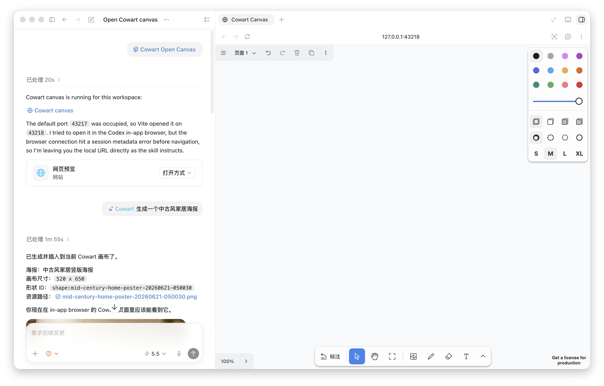
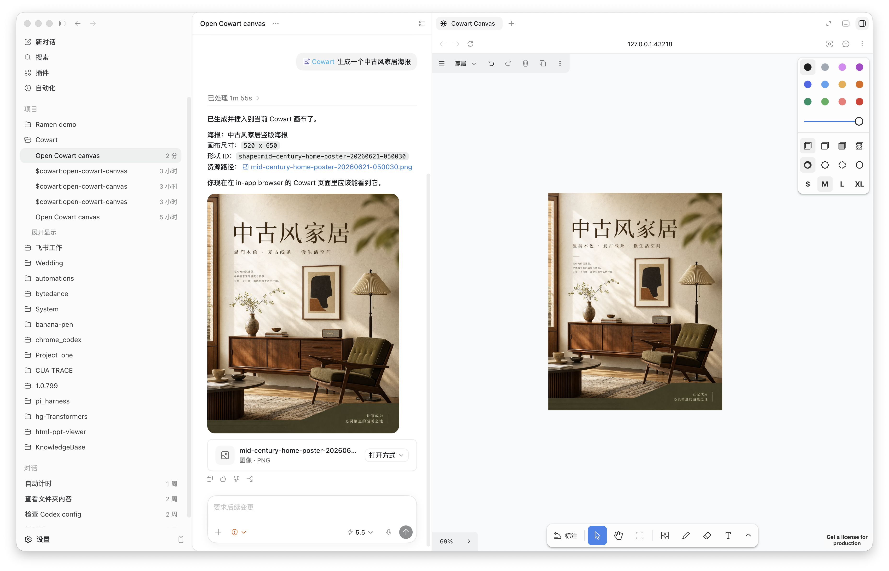
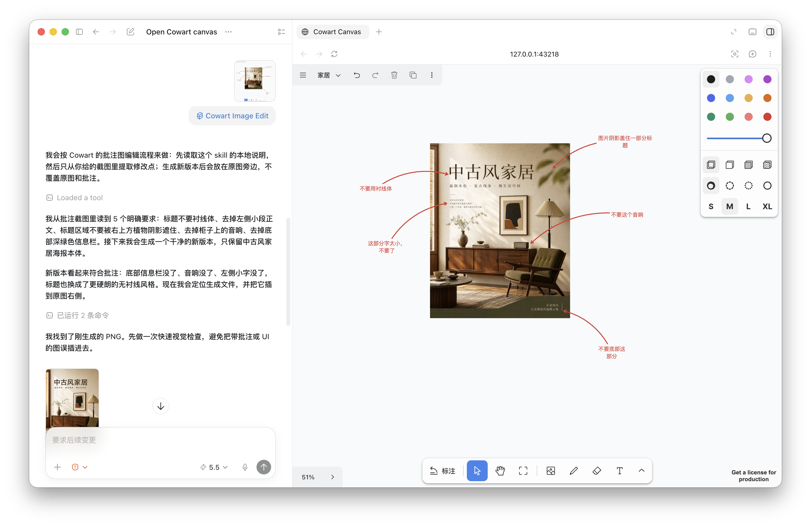

# Cowart Canvas Workflow

A Codex skill for running a local Cowart infinite canvas, inserting generated images, and keeping visual revision workflows organized inside a project.

Cowart Canvas Workflow is built for creators and builders who use Codex for visual thinking, AI image generation, and annotation-based image iteration. It bundles a local tldraw-powered canvas app plus scripts that make the common workflow smoother: open a canvas, generate an image, mark changes, and place the revised version beside the original.

## What It Does

- Opens a local Cowart infinite canvas for the current Codex project.
- Stores canvas data under the active project, not inside the skill folder.
- Inserts local images into the current Cowart page with one command.
- Places generated revisions beside the source image without deleting annotations.
- Supports dry-run placement checks before writing to the canvas.
- Handles common local-service issues such as busy ports and sandboxed port access.

## Screenshots

### Open A Local Canvas



### Generate And Insert Images



### Iterate From Annotations



## Repository Layout

```text
.
├── SKILL.md
├── agents/
│   └── openai.yaml
├── scripts/
│   ├── start-canvas.sh
│   └── insert-image.mjs
├── references/
│   └── cowart-workflow.md
└── assets/
    ├── cowart-app/
    └── screenshots/
```

## Install

Clone this repository:

```bash
git clone https://github.com/liyujinyu/cowart-canvas-skill.git
```

Copy or symlink the skill folder into your Codex skills directory:

```bash
mkdir -p ~/.codex/skills
ln -s "$PWD/cowart-canvas-skill" ~/.codex/skills/cowart-canvas-workflow
```

Start a new Codex session so the skill metadata is loaded.

## Use In Codex

Invoke the skill explicitly:

```text
Use $cowart-canvas-workflow to open the Cowart canvas for this project.
```

Common prompts:

```text
Open the Cowart canvas for this project.
```

```text
Generate a new image and insert it into the Cowart canvas.
```

```text
Use my Cowart annotation screenshot to generate a clean revised image beside the original.
```

## Run The Canvas Manually

From the skill directory:

```bash
scripts/start-canvas.sh /absolute/path/to/project
```

The script prints the local URL:

```text
Cowart canvas: http://127.0.0.1:43217
```

If `43217` is busy, it tries later ports and prints the actual one.

## Insert An Image Manually

Preview placement without writing:

```bash
node scripts/insert-image.mjs \
  --image /absolute/path/to/image.png \
  --project-dir /absolute/path/to/project \
  --canvas-url http://127.0.0.1:43217 \
  --anchor first-image \
  --dry-run
```

Insert beside the selected shape:

```bash
node scripts/insert-image.mjs \
  --image /absolute/path/to/image.png \
  --project-dir /absolute/path/to/project \
  --canvas-url http://127.0.0.1:43217 \
  --anchor selected \
  --placement right \
  --margin 40
```

## Troubleshooting

If the browser cannot load the canvas, check the service:

```bash
curl -I http://127.0.0.1:43217/
```

`HTTP/1.1 200 OK` means the local service is reachable.

If startup fails with `listen EPERM`, the environment blocked local port listening. In Codex, rerun the start command with local-service permission.

If the image would overlap existing content, run `insert-image.mjs` with `--dry-run`, then use a different anchor or larger `--margin`.

## Notes

This repository is a Codex skill package, not a standalone hosted web app. The bundled Cowart app runs locally and saves canvas state into the active project under `canvas/`.
